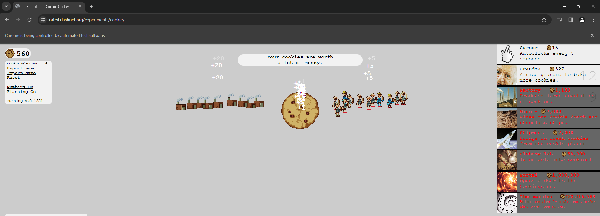

# Cookie Clicker Bot

## Introduction

Welcome to the Cookie Clicker Bot!🍪 This Python script automates the process of clicking on cookies and purchasing upgrades in the Cookie Clicker game, saving you time and effort. 
Are you ready for the ultimate cookie-clicking adventure? Step into the world of Cookie Clicker Game - Selenium Edition! But beware - this game can be dangerously addictive!

## Game Mechanics
Your goal is simple - click as much as you can on those large, delicious cookies to increase your cookies per second production. But that's not all! With the help of Selenium, 
our bot will automatically purchase upgrades every 10 seconds, such as magical grandmas 👵 or powerful bakeries 🧁, to boost your production capacity. Your clicks will create an army of cookie robots!

Warning ⚠️⚠️
However, proceed with caution! This game may be more addictive than eating cookies themselves! If you're hungry, it's better to eat a real cookie first before starting your clicking spree

## Requirements

To use this script, you'll need:
- Python 3.x
- Selenium WebDriver
- Chrome browser 

## Installation

Follow these steps to set up the script:
1. Clone the repository to your local machine.
2. Install Python if you haven't already.
3. Install Selenium WebDriver: `pip install selenium`.
4. Download the appropriate Chrome WebDriver for your system and place it in the same directory as the script.

## Usage

Here's how to use the script:
1. Run the `cookie_clicker_bot.py` script.
2. Sit back and relax as the bot opens a Chrome browser window and starts playing the Cookie Clicker game automatically.
3. Watch as it clicks on the cookie to generate cookies and purchases upgrades to boost production.
4. After 5 minutes (default duration), the bot will stop and display the cookies per second count.

## Configuration

Customize the bot's behavior using these parameters:
- `END_GAME`: Duration in seconds for how long the bot should run. Default is 5 minutes.
- `STEP_TIME`: Interval in seconds between each action (clicking cookies and purchasing upgrades). Default is 10 seconds.

## Explanation

This Python script leverages the Selenium library to automate interactions with the Chrome browser. It simulates user actions such as clicking on the cookie to generate cookies and purchasing upgrades based on accumulated cookies. At the end of its execution, the script calculates the cookies per second count.

## Issues

Encountering any issues or have suggestions for improvements? Feel free to open an issue on GitHub.
